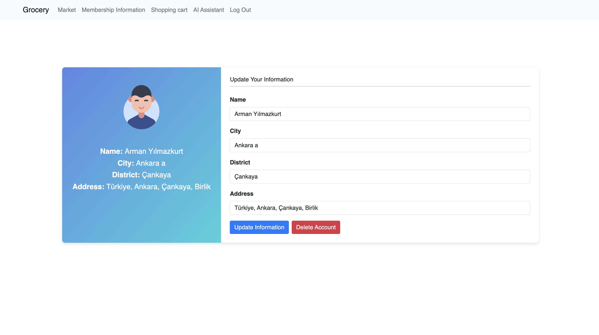
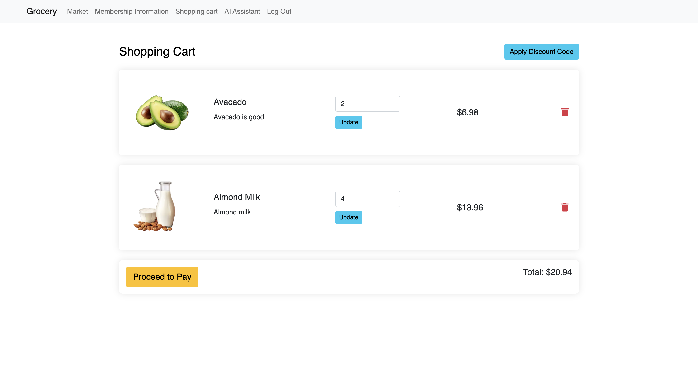
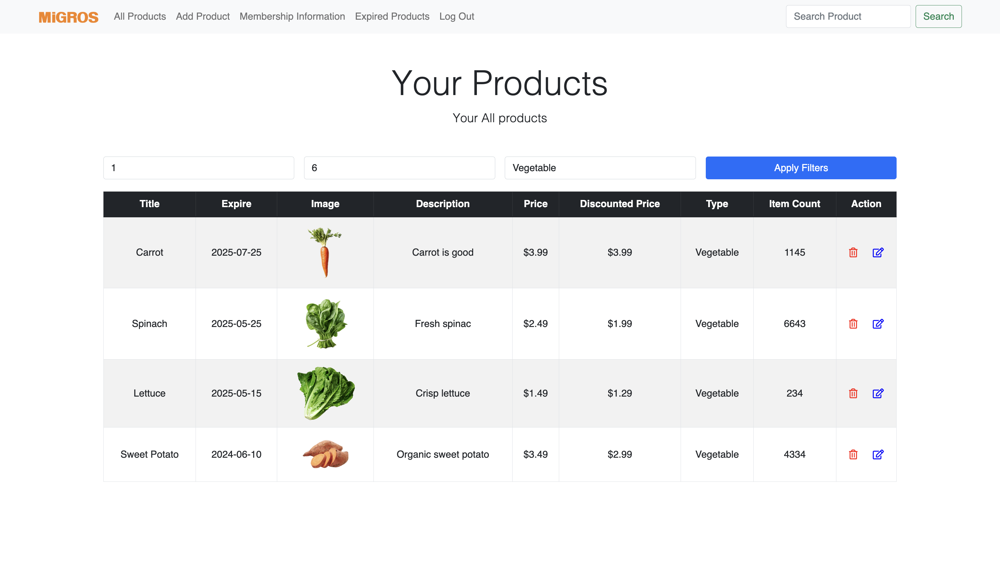
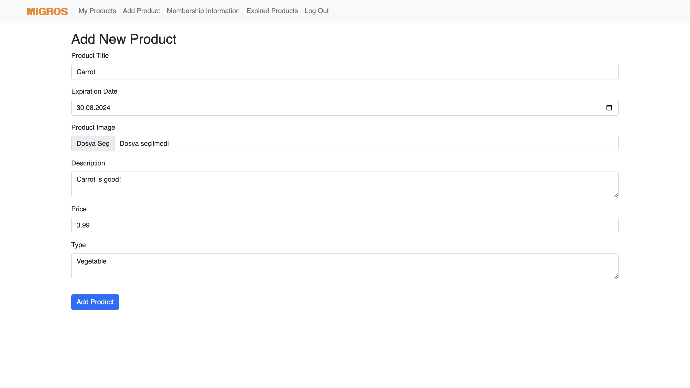
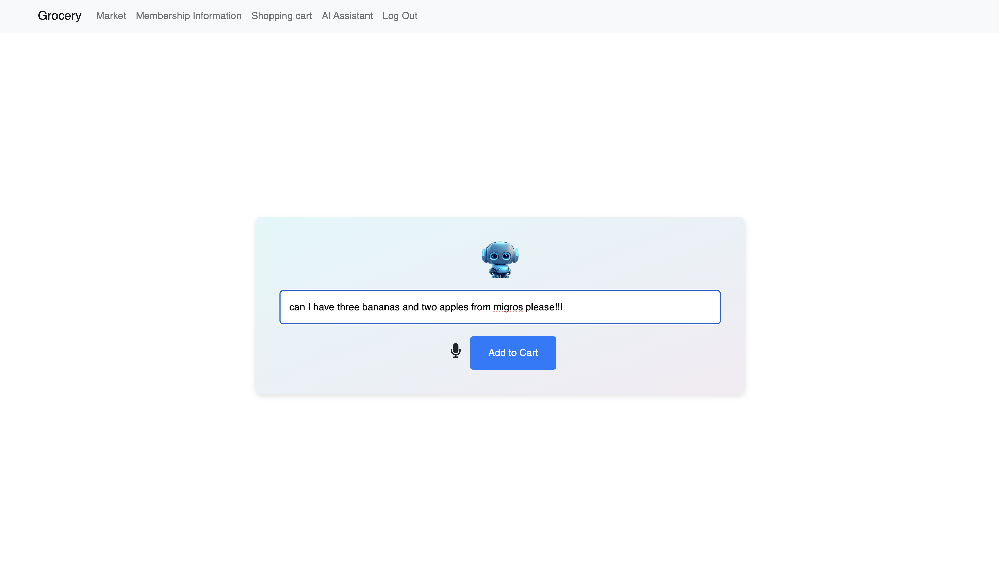
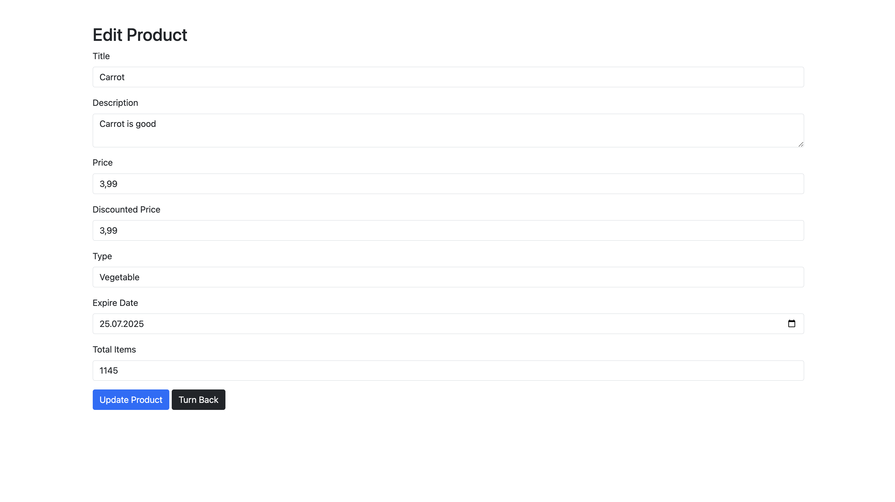

# SmartMarket

**SmartMarket** is an innovative market system designed to streamline the shopping experience for both stores and users.

## Features
- **Store Management**: Stores can add, update, and manage products.
- **User Interaction**: Users can browse, filter, and purchase products.
- **AI Integration**: AI tools assist users in adding products to their cart and viewing recommendations based on prompts.
- **Membership Management**: Users can update membership information and access exclusive market products.

## Technologies Used
- **Frontend**: HTML, CSS, JavaScript
- **Backend**: ASP.NET, .NET C#
- **Database**: PostgreSQL, MySQL
- **Cloud Services**: AWS (EC2, S3, RDS, VPC, etc.)

## Installation
1. Clone the repository:
    ```sh
    git clone https://github.com/armankurt/SmartMarket.git
    ```
2. Navigate to the project directory:
    ```sh
    cd SmartMarket
    ```
3. Install the necessary dependencies:
    ```sh
    npm install
    ```
4. Start the application:
    ```sh
    npm start
    ```

## Project Overview

### Store Management
Stores can easily add and update products. The backend system is designed to handle multiple concurrent requests, ensuring seamless management of inventory.

### User Interaction
Users can browse through a variety of products, use advanced filtering options to find exactly what they need, and make purchases with just a few clicks.

### AI Integration
With our AI tools, users receive personalized product recommendations. The AI analyzes user prompts and adds suitable products to their cart.

### Membership Management
Members can update their information, access exclusive deals, and enjoy a customized shopping experience.

## Screenshots

### Homepage


### Product Page


### Shopping Cart


### Store Management


### User Interaction


### AI Integration


### Membership Management


## Video Demonstration

### Project Overview
[Watch the full project overview](videos/video1.mov)

### Feature Demonstration
[Watch the feature demonstration](videos/video2.mov)

### User Guide
[Watch the user guide](videos/video3.mov)

## License
This project is licensed under the MIT License - see the [LICENSE](LICENSE) file for details.
